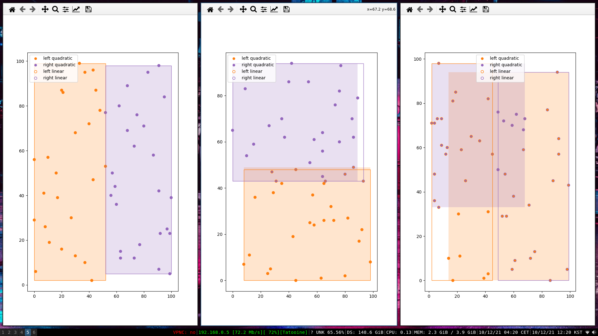

# py-playground

- Discrete Cosine Transform. [dct.py](/blob/master/dct.py) contains a implementation of the DCT, following the values and algorithms from [Wikipedia](https://en.wikipedia.org/wiki/JPEG#Discrete_cosine_transform)
- Huffman Entropy Encoding. [huffman.py](/blob/master/huffman.py) generates a codebook for symbols based on their frequency and encodes the DCT'd data.
- R-Tree. [r-tree.py](/blob/master/r-tree.py) implements parts of a R-Tree.
  - [x] quadratic split indicies of a leaf node.
  - [ ] adjust work on leaf-nodes for internal-nodes .. maybe have leaf and internal inherit Node.

3 random node splits for quadratic and linear seed pickings r-tree:

\*interestingly in the rightmost output the quadratic technique results in a worse split despite the increased computational cost.
